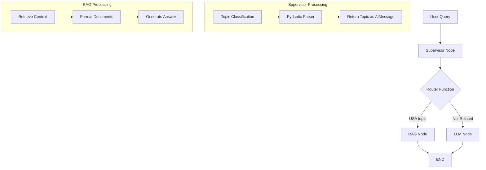

# LangGraph Conditional RAG System

A tutorial implementation of a conditional RAG system using LangGraph that routes queries between RAG and direct LLM responses based on topic classification.

## Features

- **Topic Classification**: Automatically classifies queries as USA-related or general
- **Conditional Routing**: Routes to RAG for USA topics, direct LLM for others  
- **Vector Database**: Uses Chroma for document retrieval
- **Structured Output**: Pydantic models ensure consistent LLM responses
- **State Management**: TypedDict-based state with automatic message merging

## System Architecture



## Implementation Guide

### 1. State Management

```python
class AgentState(TypedDict):
  messages: Annotated[Sequence[BaseMessage], operator.add]
```

**Key Points:**
- `TypedDict` provides type hints without class overhead
- `operator.add` tells LangGraph to append new messages automatically
- Create state as dict: `{"messages": [HumanMessage(content="hello")]}`

### 2. Topic Classification

```python
class TopicSelectionParser(BaseModel):
  Topic: Literal["USA", "Not Related"] = Field(description="selected topic")
  Reasoning: str = Field(description="reasoning behind selection")

parser = PydanticOutputParser(pydantic_object=TopicSelectionParser)
```

### 3. Vector Database Setup

```python
# Load documents
loader = DirectoryLoader("data", glob="./*.txt", loader_cls=TextLoader)
docs = loader.load()

# Chunk documents  
text_splitter = RecursiveCharacterTextSplitter(chunk_size=200, chunk_overlap=50)
chunks = text_splitter.split_documents(docs)

# Create vector database
db = Chroma.from_documents(chunks, embeddings)
retriever = db.as_retriever(search_kwargs={"k": 3})
```

## Node Functions

### Supervisor Node

```python
def supervisor_node(state: AgentState):
  question = state["messages"][-1].content  # Latest message
  
  chain = prompt | model | parser
  response = chain.invoke({"question": question})
  
  return {"messages": [AIMessage(content=response.Topic)]}
```

### Router Function

```python
def router(state: AgentState):
  classification = state["messages"][-1].content  # AI's topic classification
  
  if "usa" in classification.lower():
    return "RAG Call"
  else:
    return "LLM Call"
```

### RAG Node

```python
def rag_node(state: AgentState):
  question = state["messages"][-2].content  # Original user question
  
  rag_chain = (
    {"context": retriever | format_docs, "question": RunnablePassthrough()}
    | prompt | model | StrOutputParser()
  )
  
  result = rag_chain.invoke(question)
  return {"messages": [AIMessage(content=result)]}
```

### LLM Node

```python
def function_3(state: AgentState):
    question = state["messages"][-2].content  # Original user question
    
    complete_query = "Answer the following question with your knowledge: " + question
    response = model.invoke(complete_query)
    return {"messages": [AIMessage(content=response.content)]}
```

## Graph Construction

```python
# Create workflow
workflow = StateGraph(AgentState)

# Add nodes
workflow.add_node("Supervisor", supervisor_node)
workflow.add_node("RAG", rag_node) 
workflow.add_node("LLM", llm_node)

# Set entry point
workflow.set_entry_point("Supervisor")

# Add conditional routing
workflow.add_conditional_edges(
  "Supervisor",
  router,
  {"RAG Call": "RAG", "LLM Call": "LLM"}
)

# Add terminal edges
workflow.add_edge("RAG", END)
workflow.add_edge("LLM", END)

# Compile
app = workflow.compile()
```

## Usage Examples

```python
# USA-related query (routes to RAG)
state = {"messages": [HumanMessage(content="What is GDP of USA?")]}
result = app.invoke(state)

# General query (routes to LLM)  
state = {"messages": [HumanMessage(content="What is the weather today?")]}
result = app.invoke(state)

# Access final answer
print(result["messages"][-1].content)
```

## Message Flow

1. **User Input**: `"What is GDP of USA?"`
2. **Supervisor**: Classifies as `"USA"` 
3. **Router**: Routes to RAG based on classification
4. **RAG Node**: Retrieves context and generates answer
5. **Final State**: `[HumanMessage("What is GDP..."), AIMessage("USA"), AIMessage("GDP answer")]`

## Key Concepts

### State Merging
- Return `{"messages": [new_message]}` from nodes
- LangGraph automatically appends due to `operator.add`
- Never mutate state directly

### Message Indexing Strategy  
- `[-1]`: Latest message (often AI response)
- `[-2]`: Previous message (often original question)
- Plan indexing based on conversation flow

### Conditional vs Regular Edges
- **Conditional**: Decision-based routing with router function
- **Regular**: Direct connection between nodes