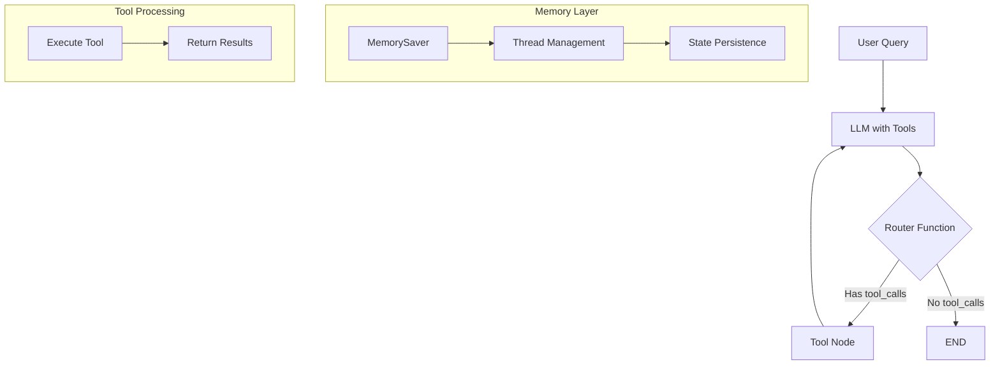

# LangGraph Tool Calling with Memory

A comprehensive tutorial on building conversational AI agents using LangGraph with tool calling capabilities and persistent memory for maintaining conversation context across interactions.

## Features

- **Tool Integration**: Automatic tool calling based on LLM decision-making
- **ReAct Architecture**: Reasoning and Acting pattern with tool feedback loops
- **Persistent Memory**: Conversation state management using thread-based memory
- **Conditional Routing**: Dynamic workflow routing based on tool requirements
- **Streaming Support**: Real-time response streaming with configurable modes

## System Architecture



## Implementation Guide

### 1. Tool Definition

```python
@tool
def search(query: str):
  """Custom tool for searching weather information"""
  if "delhi" in query.lower():
    return "the temp is 45 degree and sunny"
  return "the temp is 25 degree and cloudy"
```

**Key Points:**
- `@tool` decorator automatically creates LangChain tool objects
- Tool description helps LLM understand when to use the tool
- Return strings that provide meaningful context to the LLM

### 2. LLM Tool Binding

```python
tools = [search]
llm_with_tool = llm.bind_tools(tools)
```

**How it works:**
- `bind_tools()` adds tool descriptions to the LLM's system prompt
- LLM decides autonomously whether to call tools based on the query
- Returns special `tool_calls` format when tools are needed

### 3. Core Node Functions

#### Model Node
```python
def call_model(state: MessagesState):
  question = state["messages"]
  response = llm_with_tool.invoke(question)
  return {"messages": [response]}
```

#### Router Function
```python
def router_function(state: MessagesState):
  message = state["messages"]
  last_message = message[-1]
  if last_message.tool_calls:
    return "tools"
  return END
```

### 4. Memory Integration

```python
memory = MemorySaver()
app = workflow.compile(checkpointer=memory)

# Thread-based conversation management
config = {"configurable": {"thread_id": "1"}}
```

## Workflow Construction

### Basic Tool Calling Workflow

```python
workflow = StateGraph(MessagesState)

# Add nodes
workflow.add_node("llmwithtool", call_model)
workflow.add_node("mytools", ToolNode(tools))

# Define flow
workflow.add_edge(START, "llmwithtool")
workflow.add_conditional_edges(
  "llmwithtool",
  router_function,
  {"tools": "mytools", END: END}
)
```

### ReAct Architecture (with feedback loop)

```python
# Add feedback edge for ReAct pattern
workflow.add_edge("mytools", "llmwithtool")

app = workflow.compile(checkpointer=memory)
```

## Usage Examples

### Basic Invocation
```python
response = app.invoke({"messages": ["what is weather in delhi?"]})
print(response["messages"][-1].content)
```

### Streaming with Memory
```python
config = {"configurable": {"thread_id": "1"}}

events = app.stream(
  {"messages": ["what is weather in new delhi?"]},
  config=config,
  stream_mode="values"
)

for event in events:
  event["messages"][-1].pretty_print()
```

### Conversation Context
```python
# First query
app.stream({"messages": ["weather in delhi?"]}, config=config)

# Follow-up query - uses conversation memory
app.stream({"messages": ["what about indore?"]}, config=config) 

# Context-aware query
app.stream({"messages": ["which city had 25 degrees?"]}, config=config)
```

## Key Concepts

### Tool Decision Making
- **LLM Autonomy**: The model decides when to use tools based on query analysis
- **Format Output**: Tools must return meaningful strings for LLM processing
- **Conditional Flow**: Router functions check `tool_calls` presence for workflow direction

### ReAct Pattern
- **Reasoning**: LLM analyzes the query and decides on tool usage
- **Acting**: Tool execution provides real-world information
- **Feedback Loop**: Tool results feed back to LLM for final response generation

### Memory Management
- **Thread-based**: Each `thread_id` maintains separate conversation state
- **Persistent State**: Full conversation history preserved across interactions
- **Context Awareness**: LLM can reference previous messages and tool results

### Stream Modes
- **`"values"`**: Returns complete state after each node execution
- **`"updates"`**: Returns only the changes made by each node
- **`"debug"`**: Provides detailed execution metadata

## Configuration Options

### Thread Management
```python
# Separate conversations
config_user1 = {"configurable": {"thread_id": "user_1"}}
config_user2 = {"configurable": {"thread_id": "user_2"}}

# Access conversation history
memory.get(config_user1)
```

### Execution Modes
```python
# For final results only
result = app.invoke(input, config=config)

# For step-by-step streaming
events = app.stream(input, config=config, stream_mode="values")
```

## Best Practices

- **Strong Models**: Use capable models for reliable tool calling decisions
- **Tool Descriptions**: Write clear, specific tool descriptions for better LLM understanding
- **Memory Limits**: Consider limiting conversation history (5-10 exchanges) for performance
- **Error Handling**: Implement proper error handling for tool failures
- **Thread Management**: Use meaningful thread IDs for user session management