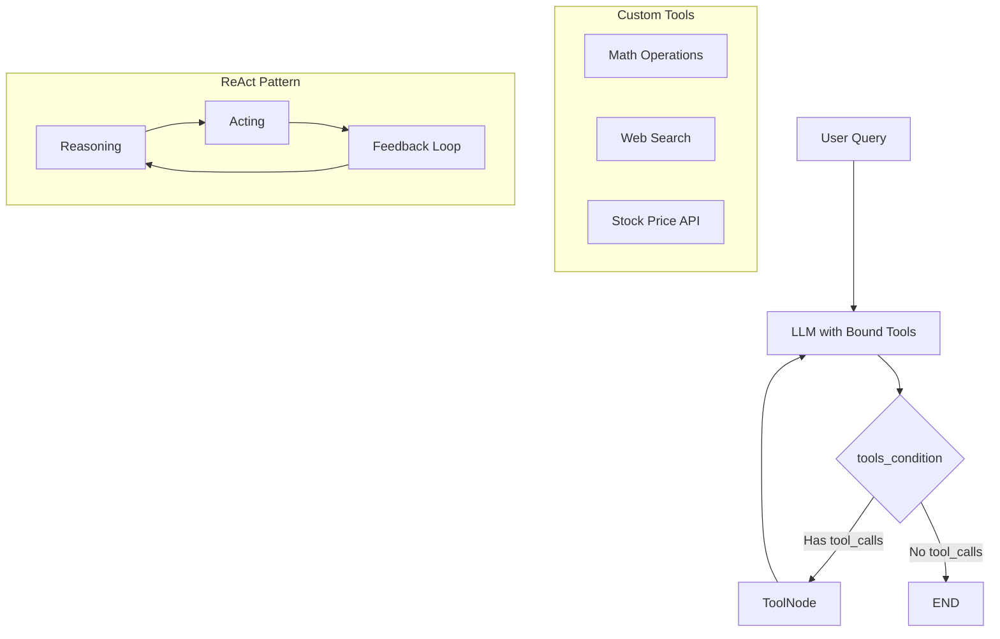

# LangGraph Tool Calling Tutorial

A hands-on tutorial demonstrating how to build intelligent agents using LangGraph with tool calling capabilities, featuring custom tools, web search integration, and the ReAct (Reasoning and Acting) pattern.

## Overview

This tutorial covers building conversational AI agents that can autonomously decide when to use tools based on user queries. The implementation follows the ReAct architecture where the LLM reasons about the task and acts by calling appropriate tools to gather information.

## System Architecture



## Key Components

### 1. Custom Tool Creation

```python
from langchain.tools import tool

@tool
def multiply(a: int, b: int) -> int:
  """
  Multiply two integers.
  
  Args:
    a (int): The first integer.
    b (int): The second integer.
    
  Returns:
    int: The product of a and b.
  """
  return a * b
```

**Best Practices:**
- Use `@tool` decorator for automatic LangChain integration
- Provide clear docstrings for LLM understanding
- Include type hints for parameter validation
- Return meaningful data types

### 2. External Tool Integration

```python
from langchain_community.tools import DuckDuckGoSearchRun
search = DuckDuckGoSearchRun()

# Yahoo Finance integration
import yfinance as yf

@tool
def get_stock_price(ticker: str) -> str:
  """Fetches the previous closing price of a given stock ticker"""
  stock = yf.Ticker(ticker)
  price = stock.info.get('previousClose')
  return f"The last closing price of {ticker.upper()} was ${price:.2f}."
```

### 3. LLM Tool Binding

```python
from langchain_groq import ChatGroq

llm = ChatGroq(
  model_name="deepseek-r1-distill-llama-70b",
  temperature=0
)

tools = [multiply, add, divide, search, get_stock_price]
llm_with_tools = llm.bind_tools(tools)
```

**Tool Binding Process:**
- `bind_tools()` adds tool descriptions to LLM context
- LLM autonomously decides when to use tools
- Returns `tool_calls` format instead of direct responses

### 4. StateGraph Implementation

```python
from langgraph.graph import MessagesState, StateGraph, END, START
from langgraph.prebuilt import ToolNode, tools_condition

def llm_decision_node(state: MessagesState):
  user_question = state["messages"]
  input_question = [SYSTEM_PROMPT] + user_question
  response = llm_with_tools.invoke(input_question)
  return {"messages": [response]}

# Build the graph
workflow = StateGraph(MessagesState)
workflow.add_node("llm_decision_step", llm_decision_node)
workflow.add_node("tools", ToolNode(tools))
workflow.add_edge(START, "llm_decision_step")
workflow.add_conditional_edges("llm_decision_step", tools_condition)
workflow.add_edge("tools", "llm_decision_step")  # ReAct feedback loop

react_graph = workflow.compile()
```

## Core Features

### Tool Decision Making
- **Autonomous Selection**: LLM analyzes queries and selects appropriate tools
- **No Tool Calls**: Direct responses for simple queries
- **Multiple Tools**: Can chain multiple tool calls for complex tasks

### ReAct Architecture
- **Reasoning**: LLM evaluates what information is needed
- **Acting**: Executes tools to gather real-world data
- **Feedback Loop**: Tool results feed back to LLM for final response

### Conditional Routing
- **tools_condition**: Built-in function that checks for `tool_calls`
- **Automatic Routing**: No manual router function needed
- **Flexible Flow**: Supports both direct answers and tool-assisted responses

## Usage Examples

### Basic Mathematical Operations
```python
message = [HumanMessage(content="What is 2+2?")]
response = react_graph.invoke({"messages": message})
```

### Web Search Integration
```python
message = [HumanMessage(content="What is the current age of TATA Group?")]
response = react_graph.invoke({"messages": message})
```

### Complex Multi-Tool Queries
```python
message = [HumanMessage(content="Get Apple's stock price and multiply it by 2")]
response = react_graph.invoke({"messages": message})
```

### Real-time Data with Calculations
```python
message = [HumanMessage(content="Add 1000 to Apple's current stock price")]
response = react_graph.invoke({"messages": message})
```

## Tool Categories

### Mathematical Tools
- `add(a, b)`: Addition of two integers
- `multiply(a, b)`: Multiplication of two integers  
- `divide(a, b)`: Division with zero-check validation

### Information Retrieval
- `DuckDuckGoSearchRun`: Web search with summarized results
- `get_stock_price(ticker)`: Real-time stock price from Yahoo Finance

### System Prompt Configuration
```python
SYSTEM_PROMPT = SystemMessage(
  content="You are a helpful assistant tasked with using search, "
          "the yahoo finance tool and performing arithmetic on a set of inputs."
)
```

## Key Learnings

### Tool Calling Behavior
- **Empty Content**: When tools are called, `response.content` is empty
- **Tool Calls Structure**: Check `response.tool_calls` for tool execution details
- **Orchestration Required**: Tools need LangGraph for actual execution

### Graph Visualization
```python
from IPython.display import Image, display
display(Image(react_graph.get_graph(xray=True).draw_mermaid_png()))
```

### Response Processing
```python
# Pretty print all messages in conversation
for message in response['messages']:
  message.pretty_print()

# Access final response
final_answer = response["messages"][-1].content
```

## Advanced Features

### Error Handling
- Built-in validation for mathematical operations
- Exception handling for external API calls
- Graceful degradation when tools fail

### Multi-Step Reasoning
- Combines multiple tools in single queries
- Maintains context across tool calls
- Provides comprehensive final answers