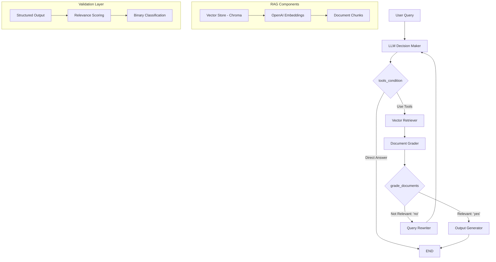

# Agentic RAG with Document Grading

An advanced Retrieval-Augmented Generation (RAG) system that uses intelligent agents to validate document relevance and improve query responses through automatic query rewriting and document grading.

## Overview

This implementation goes beyond basic RAG by adding **intelligence layers** that validate retrieved documents and rewrite queries when initial results are not relevant. The system provides more security, validation, and deterministic flow compared to traditional RAG approaches.

## System Architecture & Flow



## Workflow Breakdown

### Phase 1: Data Ingestion & Preparation

```python
# 1. Load documents from web sources
urls = [
    "https://lilianweng.github.io/posts/2023-06-23-agent/",
    "https://lilianweng.github.io/posts/2023-03-15-prompt-engineering/",
]

# 2. Split into chunks using token-based splitting
text_splitter = RecursiveCharacterTextSplitter.from_tiktoken_encoder(
    chunk_size=100, 
    chunk_overlap=25
)

# 3. Create vector store with embeddings
vectorstore = Chroma.from_documents(
    documents=doc_splits,
    collection_name="rag-chrome",
    embedding=embeddings
)
```

**Key Tools Used:**
- `WebBaseLoader`: Document loading from URLs
- `RecursiveCharacterTextSplitter`: Token-aware text chunking
- `Chroma`: In-memory vector database
- `OpenAI Embeddings`: Document vectorization

### Phase 2: Decision Making Flow

#### Node 1: LLM Decision Maker
```python
def LLM_Decision_Maker(state: AgentState):
    llm_with_tool = llm.bind_tools(tools)
    message = state["messages"]
    last_message = message[-1]
    question = last_message.content
    response = llm_with_tool.invoke(question)
    return {"messages": [response]}
```

**Purpose:** Determines if query needs tool assistance or can be answered directly

**Flow Decision:**
- **Direct Answer:** Simple queries like "hi", "hello" → END
- **Tool Required:** Complex queries → Vector Retriever

#### Node 2: Vector Retriever
```python
retriever_tool = create_retriever_tool(
    retriever,
    "retriever_blog_post",
    "Search and return information about Lilian Weng blog posts..."
)
```

**Purpose:** Embeds query and retrieves relevant document chunks

**Output:** Retrieved documents from vector store

### Phase 3: Document Validation

#### Node 3: Document Grader (Critical Innovation)
```python
class grade(BaseModel):
    binary_score: Literal["yes", "no"] = Field(
        description="Relevance score 'yes' or 'no'"
    )

def grade_documents(state: AgentState) -> Literal["generator", "rewriter"]:
    llm_with_structure_op = llm.with_structured_output(grade)
    
    # Grade document relevance
    scored_result = chain.invoke({"question": question, "context": docs})
    score = scored_result.binary_score
    
    if score == "yes":
        return "generator"  # Documents are relevant
    else:
        return "rewriter"   # Documents need better query
```

**Key Innovation:** Uses structured output to ensure consistent grading
- **Input:** User question + Retrieved documents
- **Output:** Binary decision ("yes"/"no")
- **Routing:** Determines next workflow step

### Phase 4: Response Generation or Query Improvement

#### Path A: Output Generator (Relevant Documents)
```python
def generate(state: AgentState):
    message = state["messages"]
    question = message[0].content      # Original user query
    docs = message[-1].content         # Retrieved documents
    
    prompt = hub.pull("rlm/rag-prompt")
    rag_chain = prompt | llm
    
    response = rag_chain.invoke({"context": docs, "question": question})
    return {"messages": [response]}
```

**Purpose:** Generate final answer using relevant documents
**Tools Used:** LangChain Hub RAG prompt template

#### Path B: Query Rewriter (Irrelevant Documents)
```python
def rewrite(state: AgentState):
    question = message[0].content  # Original query
    
    input = [HumanMessage(content=f"""Look at the input and try to reason 
             about the underlying semantic intent or meaning. 
             Here is the initial question: {question} 
             Formulate an improved question: """)]
    
    response = llm.invoke(input)
    return {"messages": [response]}  # Rewritten query
```

**Purpose:** Improve query when documents aren't relevant
**Flow:** Rewritten query → Back to LLM Decision Maker

## Workflow Configuration

### State Management
```python
class AgentState(TypedDict):
    messages: Annotated[Sequence[BaseMessage], add_messages]
```

### Graph Construction
```python
workflow = StateGraph(AgentState)

# Add all nodes
workflow.add_node("LLM Decision Maker", LLM_Decision_Maker)
workflow.add_node("Vector Retriever", retriever_node)
workflow.add_node("Output Generator", generate)
workflow.add_node("Query Rewriter", rewrite)

# Define flow with conditional edges
workflow.add_conditional_edges(
    "LLM Decision Maker",
    tools_condition,
    {"tools": "Vector Retriever", END: END}
)

workflow.add_conditional_edges(
    "Vector Retriever",
    grade_documents,
    {"generator": "Output Generator", "rewriter": "Query Rewriter"}
)

# Create feedback loop
workflow.add_edge("Query Rewriter", "LLM Decision Maker")
workflow.add_edge("Output Generator", END)
```

## Key Features & Innovations

### 1. Intelligent Document Validation
- **Structured Output:** Ensures consistent yes/no decisions
- **Relevance Checking:** Validates if retrieved docs answer the question
- **Automatic Routing:** Directs flow based on document quality

### 2. Query Improvement Loop
- **Semantic Understanding:** Rewrites queries for better intent capture
- **Feedback Mechanism:** Poor results trigger query enhancement
- **Iterative Refinement:** Continues until relevant documents found

### 3. Conditional Workflow
- **tools_condition:** Built-in routing for tool usage decisions
- **Custom Routing:** Document grader determines next steps
- **Multi-path Flow:** Handles both direct answers and RAG workflows

## Usage Examples

### Complex RAG Query
```python
question = "what is LLM Powered Autonomous Agents defined in LangChain blog?"
result = app.invoke({"messages": [question]})
```

**Flow Path:** LLM Decision → Vector Retriever → Document Grader → Output Generator

### Simple Direct Query
```python
result = app.invoke({"messages": ["hi how are you gpt?"]})
```

**Flow Path:** LLM Decision → END (no tools needed)

### Query Requiring Rewriting
```python
question = "what is task decomposition and Chain of thought?"
result = app.invoke({"messages": [question]})
```

**Potential Flow:** LLM Decision → Vector Retriever → Document Grader → Query Rewriter → (Loop back)

## Technical Components

### Data Sources
- **Web Documents:** Lilian Weng's blog posts on AI agents
- **Multiple URLs:** Agent systems and prompt engineering
- **Token-based Chunking:** Optimized for LLM processing

### Models & Tools
- **LLM:** OpenAI GPT models via `ChatOpenAI`
- **Embeddings:** `text-embedding-3-large` for document vectorization
- **Vector Store:** Chroma for similarity search
- **Prompt Templates:** LangChain Hub RAG prompts

### Validation Mechanisms
- **Pydantic Models:** Structured output validation
- **Binary Scoring:** Clear yes/no relevance decisions
- **Prompt Engineering:** Specific instructions for each node

## Advantages Over Basic RAG

### Security & Validation
- **Document Verification:** Ensures retrieved docs are actually relevant
- **Quality Control:** Prevents hallucination from irrelevant context
- **Deterministic Flow:** Predictable routing based on content quality

### Improved Accuracy
- **Query Refinement:** Poor initial queries get improved automatically
- **Feedback Loops:** System learns from retrieval failures
- **Context Validation:** Only uses verified relevant information

### Flexibility
- **Multi-modal Responses:** Can handle both tool-assisted and direct queries
- **Adaptive Behavior:** Adjusts strategy based on document quality
- **Extensible Architecture:** Easy to add new validation steps
